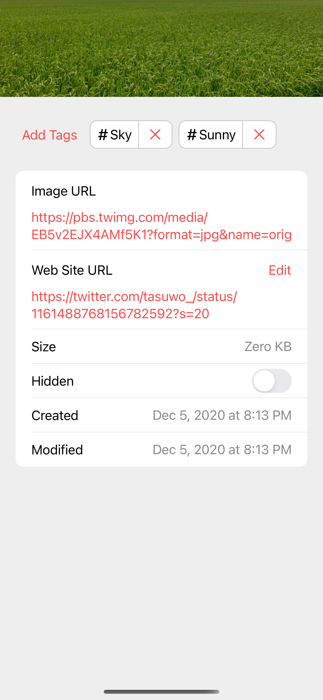
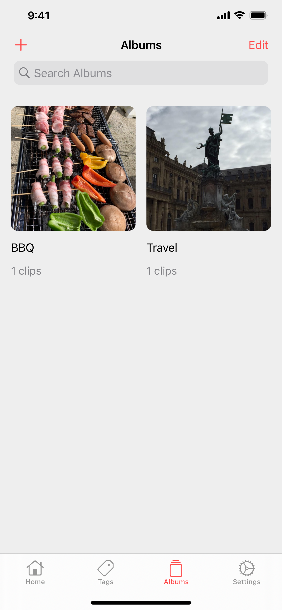

LikePics
========

LikePics is photo app for iOS/iPadOS.

- Download images
- Add tags to images
- Add images to albums
- iCloud Sync

## Screenshots

|Home|Preview|Info|
|---|---|---|
||||

|Tags|Albums|Share|
|---|---|---|
||||

## License

MIT License
